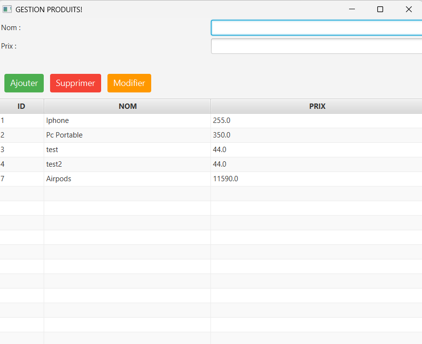

# Application de Gestion des produits

Une application JavaFX permettant de gérer les produits, avec des fonctionnalités complètes pour l'ajout, la modification, la suppression.

## Fonctionnalités

### **Gestion des Prdouits**
✅ Ajouter un produit  
✅ Modifier les informations d'un produit  
✅ Supprimer un produit
✅ Afficher la liste des produit sous forme de tableau

## Technologies utilisées

- **Java 17+** (ou une version compatible)
- **JavaFX** pour l'interface utilisateur
- **JDBC + MySQL/PostgreSQL** pour la gestion de la base de données
- **Maven** (ou Gradle) pour la gestion des dépendances

## Aperçu de l'interface

